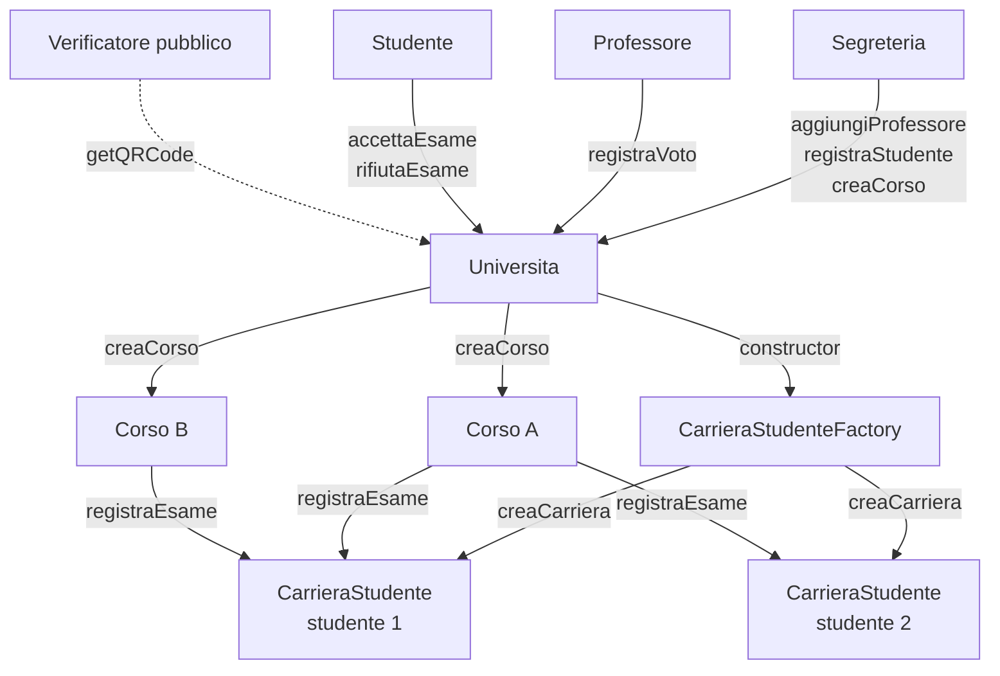
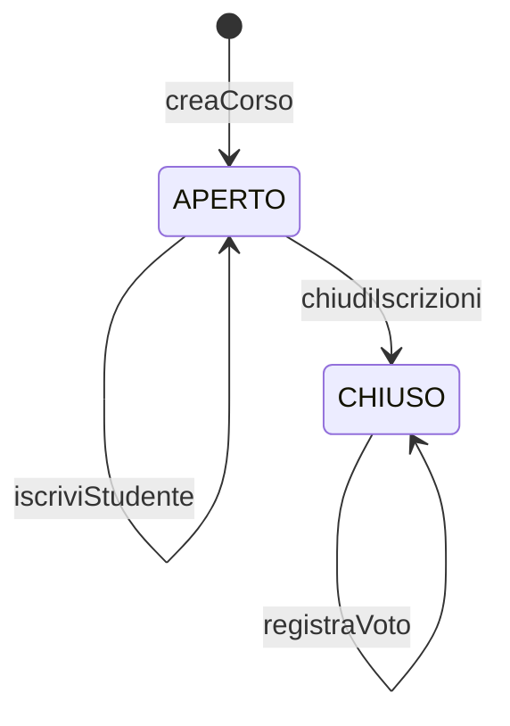
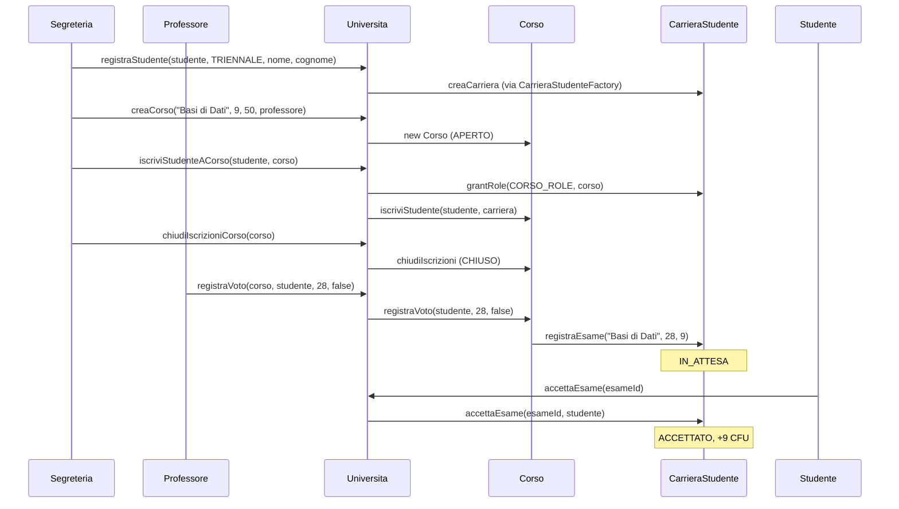

# Smart Contracts on Ethereum for Managing University Careers

This is my bachelor's thesis project. It's a small but complete system that puts a student's university career — exams, grades, credits, graduation — on the Ethereum blockchain, so that anyone can check it in seconds just by scanning a QR code.


---

## Why I built this

Think about what happens when someone needs to prove they passed their exams. A company asks for a transcript, the student requests it from the university office, waits a few days, gets a PDF, and sends it over. The company then has to trust that PDF — or call the university to double-check it.

It works, but it's slow, it's easy to fake, and everything depends on a single institution keeping the data and vouching for it.

So I asked myself a simple question: **what if the transcript didn't need to be trusted at all, because anyone could read it directly from the source?**

That's what this project does. Every student gets their own smart contract holding their academic record. Grades can only be written by the right people, every change is a signed transaction that can't be quietly edited later, and the whole career is publicly verifiable — no account, no wallet, no phone call to the registrar.

---

## How it fits together

The system is made of four smart contracts. Users only ever talk to one of them, `Universita`, which coordinates everything else behind the scenes.



A few decisions shaped the design:

- **Every student gets their own contract.** A factory deploys a new `CarrieraStudente` for each student, so each career has its own address on-chain, is isolated from the others, and can be verified on its own.
- **Every course is its own contract too.** A course keeps track of who's enrolled, whether enrollment is still open, and who already got a grade.
- **Permissions live on the blockchain, not in the UI.** I used OpenZeppelin's `AccessControl`, so even if someone bypasses the frontend entirely, the contracts still refuse anything they're not allowed to do.
- **One entry point.** The frontend only needs to know a single address — everything else can be discovered from there.

> The code is written in Italian (it's an Italian thesis), so you'll see names like *segreteria* (registrar's office), *corso* (course), *carriera* (career), *esame* (exam) and *voto* (grade).

---

## The contracts

You'll find them in [`smart_contracts/contracts`](smart_contracts/contracts).

### `Universita.sol` — the main contract

This is the only contract I deploy by hand. Its constructor takes the registrar's address and spins up the factory automatically. From here:

- the **registrar** adds or removes professors (`aggiungiProfessore`, `rimuoviProfessore`), registers students (`registraStudente`), creates courses (`creaCorso`), enrolls students (`iscriviStudenteACorso`) and closes enrollment (`chiudiIscrizioniCorso`);
- a **professor** (or the registrar) records grades with `registraVoto`;
- a **student** accepts or rejects their grades (`accettaEsame`, `rifiutaEsame`) and can update their name (`aggiornaNome`, `aggiornaCognome`);
- **anyone** can read the full career of a student through `getQRCode`, or browse the system with `getListaCorsi`, `getListaProfessori`, `getCarrieraStudente` and `isProfessore`.

### `CarrieraStudenteFactory.sol`

Its only job is to create a `CarrieraStudente` for each new student (`creaCarriera`) and remember which contract belongs to whom (`getCarriera`). Only `Universita` can call it, and a student can never end up with two careers.

### `CarrieraStudente.sol`

This is the student's record: name, surname, wallet address, degree type (bachelor's or master's) and the list of exams, each with its grade, credits (CFU) and status.

Whether the student has graduated isn't something anyone types in — `isLaureato` works it out: **180 credits** for a bachelor's degree (`TRIENNALE`), **120** for a master's (`MAGISTRALE`). Only accepted exams count, and `getCFUTotali` returns their sum. `getStudenteInfo` returns the whole record in one call.

And only a course the student is actually enrolled in is allowed to call `registraEsame` here.

### `Corso.sol`

A course has a name, a number of credits (1 to 20), a maximum number of students and a professor. It lives in one of two states:



While the course is **open** (`APERTO`) you can enroll students with `iscriviStudente`. Once `chiudiIscrizioni` is called the course is **closed** (`CHIUSO`), enrollment stops — and only then can `registraVoto` be used. Each student gets exactly one grade per course. Grades go from 0 to 30, and a *30 cum laude* (the Italian top mark) is stored as 31.

---

## Who can do what

| Role | Who has it | What they can do |
|---|---|---|
| `SEGRETERIA_ROLE` | The account that deployed the system | Everything administrative: professors, students, courses, enrollment, grades |
| `PROFESSORE_ROLE` | Professors added by the registrar | Record grades |
| `STUDENTE_ROLE` | Students registered by the registrar | Accept or reject their own grades, update their name |
| `CORSO_ROLE` | Each `Corso` contract | Write exams into the careers of its enrolled students |
| Anyone | No role needed | Read a student's full career |

One detail I'm quite happy with: a student always goes through the main `Universita` contract, which acts on their behalf when talking to their career. The career contract checks that the request really comes from that specific student, so nobody else can accept or reject grades in their name.

---

## The life of an exam

Here's what happens from the moment a student is registered to the moment their credits go up:



Just like in a real Italian university, the student gets to decide whether to keep a grade:

- `IN_ATTESA` (pending) — a passing grade (18 or more) has just been recorded and is waiting for the student.
- `ACCETTATO` (accepted) — the student called `accettaEsame`, keeps the grade and the credits are added.
- `RIFIUTATO` (rejected) — the student called `rifiutaEsame` and turned it down; no credits.
- `INSUFFICIENTE` (failed) — the grade is below 18. Nothing to accept or reject, it simply doesn't count.

---

## Verifying a career with a QR code

This is my favourite part, and really the point of the whole project.

In the app, a student can open **My QR** and get a QR code pointing to `/verifica/<their wallet address>`. Whoever scans it lands on a public page that reads the student's entire career straight from the blockchain: personal details, degree type, every exam with its grade, credits and status, total credits and whether they've graduated.

The QR code isn't a certificate — it's a pointer to the source. That means it's always up to date and there's nothing to forge. The page also shows where the data came from (contract address, block number, a link to Etherscan) so the person checking can verify it themselves. And they don't need a wallet or any crypto knowledge to do it.

---

## The web app: Cattedra

The frontend is called **Cattedra** and lives in [`frontend`](frontend). It's built with **Next.js 16**, **React 19**, **Tailwind CSS 4** and **viem**, and uses **MetaMask** as the wallet.

When you connect your wallet, the app asks the contract which roles you have and shows you only the areas you can actually use:

- **Registrar** — manage professors, register students, create courses, handle enrollment and grades.
- **Professor** — see your courses and record grades.
- **Student** — follow your progress towards graduation, accept or reject pending grades, edit your profile and get your QR code.
- **Public** — look up and verify any career, no wallet needed.

A couple of things I paid attention to:

- **No wasted gas on obvious mistakes.** Before asking for a signature, every transaction is simulated first. If the contract would reject it, you see the reason straight away instead of opening MetaMask and paying for a failed transaction.
- **The UI follows the contract's rules.** For example, the grade form only shows up once a course's enrollment is closed, because that's when the contract allows it.
- **Reliable reads.** The app uses more than one public Sepolia node with automatic fallback, and batches reads together with Multicall3 so pages load faster.

---

## Tests

The contracts are covered by **117 tests** written in Solidity and run with Hardhat 3, in [`smart_contracts/test`](smart_contracts/test). I tried to test the unhappy paths as much as the happy ones: missing permissions, out-of-range grades, cum laude on anything other than a 30, double enrollment, courses that are full, grading while enrollment is still open, accepting the same exam twice, and the graduation thresholds for both degree types.

```bash
cd smart_contracts
npx hardhat test
```

---

## Where it's deployed

The system runs on the **Sepolia** Ethereum testnet (chain ID `11155111`) and was deployed with Hardhat Ignition.

**Universita:** [`0x1fFf2f10994573d2AC59de2769b4612C445825D1`](https://sepolia.etherscan.io/address/0x1fFf2f10994573d2AC59de2769b4612C445825D1)

The factory is created by the `Universita` constructor, while courses and careers are created on the fly as the system is used. Whoever deploys the contract becomes the registrar.

---

## Running it yourself

You'll need Node.js 20 or newer and MetaMask set to Sepolia with a little test ETH (any Sepolia faucet will do).

**Smart contracts**

```bash
cd smart_contracts
npm install
npx hardhat compile
npx hardhat test

# deploy to Sepolia
npx hardhat ignition deploy ignition/modules/Universita.ts --network sepolia
```

**Frontend**

```bash
cd frontend
npm install
npm run dev
```

Then open [http://localhost:3000](http://localhost:3000).

If you deploy your own copy, remember to update `CONTRACT_ADDRESS` in `frontend/app/client.ts` — and if you've changed the contracts, the ABIs in `frontend/app/abi.ts` and `frontend/app/abi-contratti.ts` too.

---

## What's in the repo

```
.
├── smart_contracts/
│   ├── contracts/
│   │   ├── Universita.sol               # main contract, the single entry point
│   │   ├── CarrieraStudenteFactory.sol  # creates student careers
│   │   ├── CarrieraStudente.sol         # one student's record
│   │   └── Corso.sol                    # one course
│   ├── test/                            # 117 Solidity tests
│   ├── ignition/modules/Universita.ts   # deployment module
│   └── hardhat.config.ts
└── frontend/
    └── app/
        ├── segreteria/  professore/  studente/  verifica/  connetti/
        ├── components/                  # reusable UI components
        ├── client.ts                    # viem client, simulate-then-write
        ├── letture.ts                   # reading data from the contracts
        ├── WalletProvider.tsx           # wallet connection and roles
        └── abi.ts, abi-contratti.ts     # contract ABIs
```
